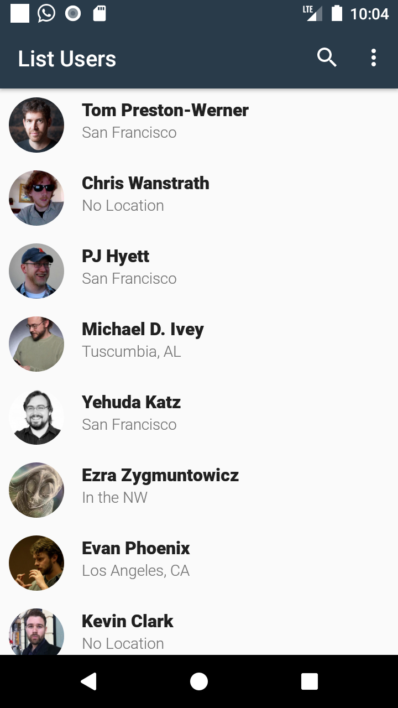
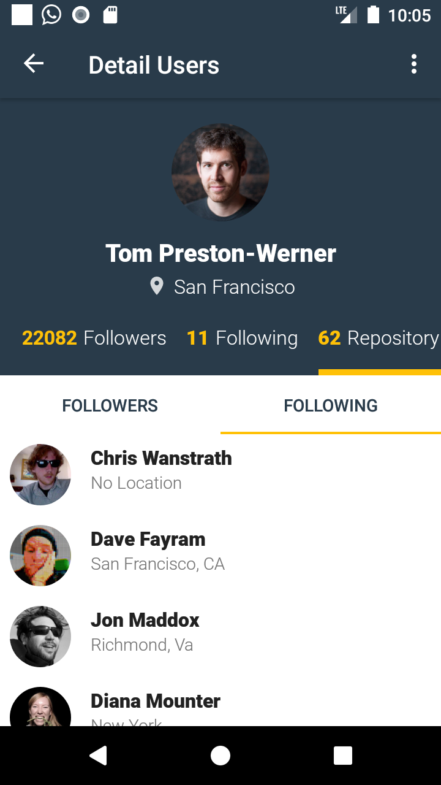

# GithubUsers-AndroidApp
GithubUser Android Application

This project using the Architecture Components:
- Room
- Lifecycle-aware components
- ViewModels
- LiveData
- Paging3
- Navigation
- DataBinding
- WorkManager

## Screenshots

<p align="center">
  
  
</p>

## Development Roadmap

- [x] [Kotlin](https://kotlinlang.org/)
- [ ] [Room](https://developer.android.com/topic/libraries/architecture/room)
- [x] [Lifecycle-aware components](https://developer.android.com/topic/libraries/architecture/lifecycle)
- [x] [ViewModels](https://developer.android.com/topic/libraries/architecture/viewmodel)
- [x] [LiveData](https://developer.android.com/topic/libraries/architecture/livedata)
- [x] [Paging3](https://developer.android.com/topic/libraries/architecture/paging/)
- [x] [Navigation](https://developer.android.com/topic/libraries/architecture/navigation)
- [x] [DataBinding](https://developer.android.com/topic/libraries/data-binding)
- [ ] [WorkManager](https://developer.android.com/topic/libraries/architecture/workmanager/)
- [ ] [Coroutines](https://developer.android.com/topic/libraries/architecture/coroutines)
- [ ] [Gradle Kotlin DSL](https://docs.gradle.org/current/userguide/kotlin_dsl.html)
- [x] [Retrofit](https://square.github.io/retrofit/)
- [ ] [Koin](https://insert-koin.io/)
- [ ] [Ktlint](https://ktlint.github.io/)
- [x] RxAndroid
- [x] RxJava
- [x] Dagger Hilt
- [x] Android KTX
- [x] JUnit
- [x] Mockito
- [x] [MotionLayout](https://developer.android.com/training/constraint-layout/motionlayout)
- [x] Transition Animations

## Features

- [x] Search Users
- [x] List Users
- [x] Detail Users
- [x] Change Language
- [ ] Favorite
- [ ] About

## License

All the code available under the Apache License. See [LICENSE](LICENSE).

```
Apache License

Copyright (c) 2020 Ghozi Mahdi

Licensed under the Apache License, Version 2.0 (the "License");
you may not use this file except in compliance with the License.
You may obtain a copy of the License at

http://www.apache.org/licenses/LICENSE-2.0

Unless required by applicable law or agreed to in writing, software
distributed under the License is distributed on an "AS IS" BASIS,
WITHOUT WARRANTIES OR CONDITIONS OF ANY KIND, either express or implied.
See the License for the specific language governing permissions and
limitations under the License.
```
